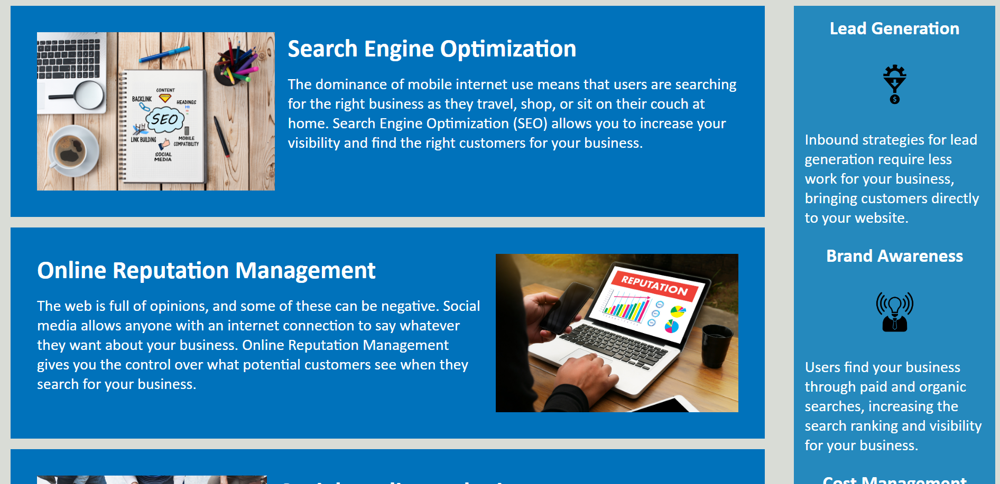

# Horiseon-Access-Upgrade

Horiseon Access Upgrade

This project was created in order to upgrade the accessibility in the Horiseon website!
Alt attributes have been edited to aid screen readers, and links have been fixed to work correctly!
Additional changes have been made to improve the visitors visual experience. 

<<<<<<< HEAD
Click the link below to visit the website yourself!
<link href="https://melissabarrerafarias.github.io/Horiseon-Access-Upgrade/">
=======
Click the link below to visit the website!
<<<<<<< HEAD
<link href="https://melissabarrerafarias.github.io/Horiseon-Access-Upgrade/">
>>>>>>> 6aed685... README file finalized
 
=======
<link href="https://melissabarrerafarias.github.io/Horiseon-Access-Upgrade/"> 
>>>>>>> 16d121c... README finalized
